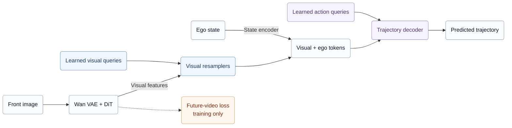

# LightWAM-AD

A one-pass driving policy built on **Wan2.1-T2V-1.3B** and the
[SimWAM codebase](https://github.com/H-EmbodVis/SimWAM). It learns from future-video
supervision and directly predicts trajectories from current-image features.

[Checkpoint](https://huggingface.co/l1ziang/LightWAM-AD-e100) ·
[Setup & usage](docs/getting_started.md) · [Architecture details](docs/architecture.md) ·
[Experiment record](docs/results/lightwam_ad_e100_h200.md) · [Benchmark guide](docs/inference_benchmark.md)

## Model architecture

Learned visual queries compress multi-layer Wan features into visual tokens.
Learned action queries then attend to the visual tokens and encoded ego state
to predict the trajectory.



- **Training:** joint future-latent flow matching and trajectory Smooth L1 regression.
- **Inference:** one current-image pass; no future generation or iterative action denoising.

Following [Fast-WAM](https://arxiv.org/abs/2603.16666), the attention mask isolates
current-frame features from future tokens during training.

## Data and training

| Item | Configuration |
| --- | --- |
| Driving data | NAVSIM/OpenScene (nuPlan); 84,258 training + 851 validation clips |
| Supervision | Current + 8 future front images; 8 expert ego poses over 4 seconds |
| Inference inputs | Current front RGB at 384 × 672, 8-D ego state, cached static T5 prompt |
| Adaptation | Rank-64 LoRA; feature taps at blocks 8, 16, 24 |
| Training | 100 epochs, effective batch 64, BF16, AdamW, cosine LR from 1e-4 |

The run uses the configured navtrain subset, with no SimScale data or RL.
Data selection and exact commands are in the [usage guide](docs/getting_started.md).

## Results: LightWAM-AD and SimWAM

**NAVSIM-v2 EPDMS** (0–100, higher is better), single front camera at 384 × 672.
Both models use imitation-learning checkpoints before RL.

| Model | Video backbone | navtest | navhard |
| --- | --- | ---: | ---: |
| SimWAM | Wan2.2-5B | 90.2 | 37.6 |
| LightWAM-AD, epoch 100 | Wan2.1-1.3B | **88.576** | **33.281** |

SimWAM scores are from [the paper, Tables 2–3](https://arxiv.org/html/2608.07468v4);
backbones and training selections differ. Our `step_131700.pt` evaluation covers
12,146 navtest and 5,912 navhard scenes. [Full metrics and provenance](docs/results/lightwam_ad_e100_h200.md).

## Efficiency and model size

**NVIDIA H200 · batch 1 · BF16 · no compilation or LoRA merge.**

| Inference path | Policy mean (ms) | E2E mean (ms) | E2E p95 (ms) | Peak allocated (GiB) |
| --- | ---: | ---: | ---: | ---: |
| Baseline, 30 blocks | 62.538 | 71.570 | 93.127 | 3.770 |
| Early exit, 25 blocks | 54.494 | 63.575 | 75.135 | 3.770 |

E2E includes in-memory image preprocessing, transfers, model execution and CPU
trajectory output; it excludes scene/JPEG/text-cache loading and PDM scoring.
Early exit retains all weights and matches baseline outputs exactly on 200
sampled scenes. The NAVSIM scores above use the baseline path.

| Parameter scope | Count |
| --- | ---: |
| Full loaded model | **1,656,343,350 (1.656B)** |
| Trainable parameters | **110,555,459 (110.56M)** |

Loaded parameters include the VAE encoder/decoder; T5 embeddings are cached.
See the [module breakdown](docs/architecture.md#parameters-and-checkpoints).
SimWAM reports 518 ms / 10 steps and 297 ms / 5 steps on A100
([Table 13](https://arxiv.org/html/2608.07468v4)); different hardware and timing
boundaries prevent a direct speedup comparison.

## Getting started

Follow [setup & usage](docs/getting_started.md) to install, train and evaluate,
or the [benchmark guide](docs/inference_benchmark.md) to measure latency.

Download the [epoch-100 checkpoint](https://huggingface.co/l1ziang/LightWAM-AD-e100)
from the repository root:

```bash
python - <<'PY'
from huggingface_hub import hf_hub_download
hf_hub_download("l1ziang/LightWAM-AD-e100", "step_131700.pt", local_dir="checkpoints/weights")
PY
export CKPT="$PWD/checkpoints/weights/step_131700.pt"
```

The checkpoint contains adapted weights, including LoRA and the trajectory head.
Obtain the original DiT/VAE and T5/tokenizer from
[Wan2.1-T2V-1.3B](https://huggingface.co/Wan-AI/Wan2.1-T2V-1.3B) separately.
T5 is used to prepare the text cache; cached-text inference does not load T5.
Datasets are obtained separately as described in the setup guide.

## License

[MIT](LICENSE), with upstream attribution in [NOTICE](NOTICE).
Third-party code, weights and datasets retain their respective licenses.

## Acknowledgements

We thank the **[SimWAM](https://github.com/H-EmbodVis/SimWAM)** authors for the
codebase and training, data and evaluation infrastructure this project builds on.
We also acknowledge [Light-WAM](https://arxiv.org/abs/2606.08242),
[Fast-WAM](https://arxiv.org/abs/2603.16666), Wan, NAVSIM, OpenScene and nuPlan.
